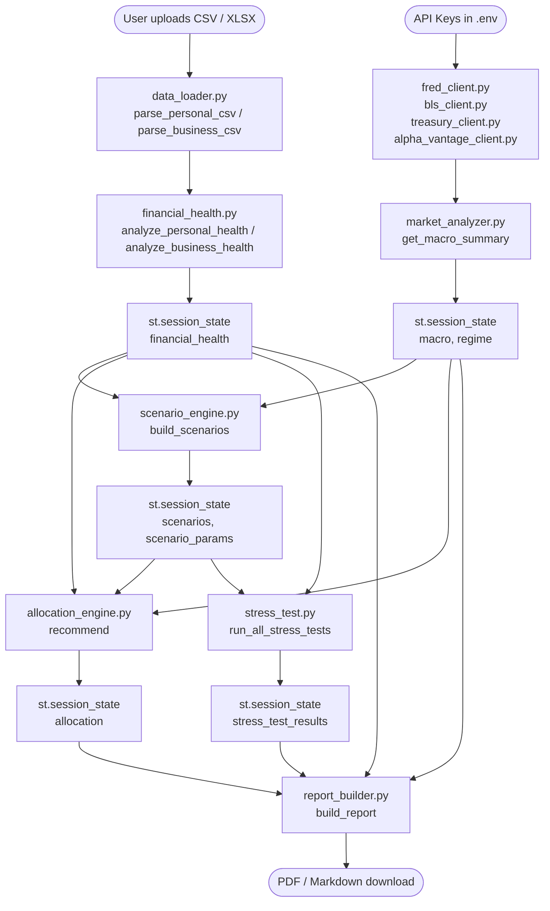

# MoneyMap AI — Project Documentation

> Deep technical reference for contributors and maintainers.
> For end-user setup, see [README.md](README.md).

---

## Table of Contents

1. [Purpose and Scope](#1-purpose-and-scope)
2. [System Architecture](#2-system-architecture)
3. [Repository Layout](#3-repository-layout)
4. [API Clients](#4-api-clients)
5. [Analysis Modules](#5-analysis-modules)
6. [Streamlit Pages](#6-streamlit-pages)
7. [Session State Flow](#7-session-state-flow)
8. [Page Guards](#8-page-guards)
9. [Statistical Methods Catalog](#9-statistical-methods-catalog)
10. [Testing Strategy](#10-testing-strategy)
11. [Notebooks](#11-notebooks)
12. [Data Sources](#12-data-sources)
13. [Known Limitations and Future Work](#13-known-limitations-and-future-work)

---

## 1. Purpose and Scope

### What MoneyMap AI does

MoneyMap AI answers one question: **"Where should your next dollar go?"**

It ingests a user's transaction history (personal or business CSV/XLSX), enriches it with live macroeconomic data from four public APIs, runs probabilistic simulations, and produces a ranked allocation recommendation with plain-English reasoning. The entire pipeline runs locally — no data leaves the user's machine.

### Who it is for

| User | How they use it |
|------|----------------|
| **Individual / household** | Upload bank/credit card exports; get a savings rate, emergency fund status, debt paydown vs investing recommendation |
| **Small business owner** | Upload accounting exports; get gross margin, runway, burn rate, and capital allocation guidance |
| **Data science student / practitioner** | Explore the src/ modules for Monte Carlo, VaR, scenario engine, and macro regime detection implementations |
| **Contributor / maintainer** | Use this document to understand the full system before making changes |

### What problem it solves

Generic financial advice ("save 20 % of income", "max your 401k first") ignores individual context and the macro environment. MoneyMap AI combines:

- **Personal context** — actual income, spending, debt, savings, runway
- **Macro context** — live Fed Funds rate, CPI, unemployment, yield curve regime
- **Probabilistic modelling** — Monte Carlo cash-flow simulation, stress testing against historical shocks
- **Explicit scoring** — every recommendation comes with a numeric score and the exact rule that produced it

---

## 2. System Architecture

### Data flow



### Key design principles

1. **Pure analysis layer** — every function in `src/` is pure Python (no Streamlit calls). Pages call these functions and render results. This keeps the analysis testable and reusable outside Streamlit.

2. **Graceful API degradation** — all four API clients fall back to deterministic synthetic data when keys are missing or network fails. The app is fully functional offline.

3. **Session state as pipeline bus** — data flows forward through `st.session_state` keys. Each page writes its outputs and the next page reads them. Page guards enforce this ordering.

4. **Explicit scoring** — the allocation engine uses hand-crafted rule chains, not ML. Every score is reproducible and auditable.

---

## 3. Repository Layout

| Path | Role |
|------|------|
| `app/Home.py` | Streamlit entry point. Sets `mode` in session state. |
| `app/page_guards.py` | Four guard helpers that stop page execution when prerequisites are unmet. |
| `app/pages/1_Connect_Data.py` | File upload and sample data loader. Writes `raw_df`, `data_summary`. |
| `app/pages/2_Financial_Health.py` | Calls analysis layer; renders health metrics. Writes `financial_health`. |
| `app/pages/3_Market_Economy.py` | Fetches macro data via API clients; classifies regime. Writes `macro`, `regime`. |
| `app/pages/4_Scenario_Lab.py` | Interactive sliders + Monte Carlo projections. Writes `scenario_params`, `scenarios`. |
| `app/pages/5_Allocation_Engine.py` | Runs allocation scoring. Writes `allocation`. |
| `app/pages/6_Stress_Test.py` | Runs all 5 stress scenarios. Writes `stress_test_results`. |
| `app/pages/7_Report_Center.py` | Compiles report; renders Markdown; offers PDF download. |
| `src/data_loader.py` | CSV/XLSX ingestion, normalisation, sign-convention enforcement, categorisation. |
| `src/analysis/financial_health.py` | Personal and business health metrics, anomaly detection, flags. |
| `src/analysis/market_analyzer.py` | Macro regime classifier (4 buckets) and rate environment advice. |
| `src/analysis/scenario_engine.py` | Base/upside/downside GBM cash-flow simulations. |
| `src/analysis/allocation_engine.py` | Explicit rule-based scoring and ranked recommendation. |
| `src/analysis/stress_test.py` | Five historical-style shock scenarios with 24-month cash path simulation. |
| `src/analysis/monte_carlo.py` | GBM portfolio and cash-flow simulation primitives. |
| `src/analysis/portfolio_stats.py` | Sharpe ratio, beta, max drawdown, correlation matrix, portfolio return/volatility. |
| `src/analysis/risk_metrics.py` | Historical VaR, CVaR, GBM confidence bands. |
| `src/analysis/sensitivity.py` | One-at-a-time sensitivity sweeps with tornado chart. |
| `src/analysis/report_builder.py` | Assembles report dict; renders to Markdown and PDF (fpdf2). |
| `src/api_clients/fred_client.py` | FRED API wrapper with 1-hour cache and deterministic fallback. |
| `src/api_clients/bls_client.py` | BLS API wrapper with retry logic and deterministic fallback. |
| `src/api_clients/treasury_client.py` | U.S. Treasury Fiscal Data API wrapper with fallback. |
| `src/api_clients/alpha_vantage_client.py` | Alpha Vantage wrapper with rate-limit sleep and fallback. |
| `src/utils/constants.py` | Regime thresholds, allocation tiers, historical scenario parameters. |
| `src/utils/formatting.py` | Currency, percentage, and number formatting helpers. |
| `data/sample/sample_personal.csv` | 12-month personal transaction sample (seeded, realistic). |
| `data/sample/sample_business.csv` | 12-month business cash flow sample (seeded, realistic). |
| `tests/` | pytest suite — 7 files covering analysis modules and API fallbacks. |
| `notebooks/` | Three Jupyter notebooks for macro EDA, model development, and backtesting. |
| `scripts/gen_samples.py` | Regenerates sample CSVs from seed. |
| `scripts/setup_repo.py` | Prints GitHub topics for the repo. |
| `.streamlit/config.toml` | Dark theme (Plotly dark + GitHub-style colour palette). |
| `.github/workflows/ci.yml` | CI: pytest with coverage + ruff lint on push/PR to main. |
| `.env.example` | Template for FRED, Alpha Vantage, and BLS API keys. |

---

## 4. API Clients

All four clients share the same design contract:

- Constructor accepts an optional `api_key` (falls back to environment variable)
- Every public method returns a DataFrame or dict — never raises
- On any failure, returns synthetic deterministic data and emits `UserWarning`
- Results are cached in `st.session_state` (or an in-memory dict when outside Streamlit) with a 1-hour TTL
- `df.attrs["is_fallback"]` is `True` when synthetic data is returned

### 4.1 FREDClient (`src/api_clients/fred_client.py`)

**Library:** `fredapi` (wraps FRED REST API)

**Series pulled:**

| FRED ID | Metric | Frequency |
|---------|--------|-----------|
| `DFF` | Fed Funds Effective Rate | Daily |
| `CPIAUCSL` | CPI All Urban Consumers SA | Monthly |
| `UNRATE` | Unemployment Rate | Monthly |
| `DGS10` | 10-Year Treasury Constant Maturity | Daily |
| `DGS2` | 2-Year Treasury Constant Maturity | Daily |
| `A191RL1Q225SBEA` | Real GDP Growth (QoQ annualised) | Quarterly |
| `SP500` | S&P 500 Index | Daily |

**Derived series:**
- `yield_spread` = DGS10 − DGS2 (computed in `get_macro_dashboard`)
- `cpi_yoy` = 12-month % change of CPIAUCSL

**Public methods:**

```python
FREDClient(api_key: Optional[str] = None)

get_series(series_id: str,
           start: Optional[Union[str, pd.Timestamp]] = None,
           end: Optional[Union[str, pd.Timestamp]] = None) -> pd.DataFrame
# Returns DataFrame with DatetimeIndex named "date" and column "value".

get_macro_dashboard(lookback_years: int = 2) -> Dict[str, Any]
# Returns dict with keys: fed_funds, cpiaucsl, cpi_yoy, unemployment,
# t10yr, t2yr, yield_spread, gdp_growth, sp500, _is_fallback.
# Each value is a DataFrame with "date" index and "value" column.

get_latest_values() -> Dict[str, Optional[float]]
# Returns most recent scalar for each dashboard series.
```

**Fallback:** `sample_macro_dashboard(lookback_years)` generates synthetic series using `np.random.default_rng(seed=42)` seeded GBM/AR(1) processes. The `_is_fallback=True` flag is propagated to the Market & Economy page, which displays a warning banner.

---

### 4.2 BLSClient (`src/api_clients/bls_client.py`)

**Endpoint:** `https://api.bls.gov/publicAPI/v2/timeseries/data/`

**Series pulled:**

| BLS Series ID | Metric |
|--------------|--------|
| `CUUR0000SA0` | CPI-U All Items (All Urban Consumers) |
| `CUUR0000SA0L1E` | CPI-U Core (ex Food & Energy) |
| `CES0500000003` | Average Hourly Earnings, All Employees |

**Public methods:**

```python
BLSClient(api_key: Optional[str] = None)

get_cpi_data(lookback_years: int = 3) -> pd.DataFrame
# Returns DataFrame indexed by date, columns: value (CPI level), yoy_pct.

get_wage_data(lookback_years: int = 3) -> pd.DataFrame
# Returns DataFrame indexed by date, columns: value ($/hr), yoy_pct.

get_latest_cpi_yoy() -> Optional[float]
get_latest_wage_growth() -> Optional[float]
```

**Retry logic:** 3 retries with delays of `[2, 5, 10]` seconds before falling back to synthetic data.

---

### 4.3 TreasuryClient (`src/api_clients/treasury_client.py`)

**Endpoint:** `https://api.fiscaldata.treasury.gov/services/api/fiscal_service/v1/accounting/od/avg_interest_rates`

**Data:** Average interest rates on U.S. Treasury securities by maturity.

**Public methods:**

```python
TreasuryClient()

get_treasury_rates(lookback_months: int = 24) -> pd.DataFrame
# Tidy DataFrame: columns = maturity (label), rate_pct. Indexed by date.

get_rates_pivot(lookback_months: int = 24) -> pd.DataFrame
# Wide DataFrame: each column is a maturity, index is date.

get_latest_rates() -> dict
# {maturity_label: latest_rate_pct}
```

**Maturity labels mapped from security descriptions:**
`3-Month`, `6-Month`, `1-Year`, `2-Year`, `5-Year`, `10-Year`, `20-Year`, `30-Year`

---

### 4.4 AlphaVantageClient (`src/api_clients/alpha_vantage_client.py`)

**Endpoint:** `https://www.alphavantage.co/query`

**Function used:** `TIME_SERIES_DAILY_ADJUSTED`

**Rate limiting:** 12-second sleep between requests to stay within free-tier limits (5 req/min, 25 req/day).

**Public methods:**

```python
AlphaVantageClient(api_key: Optional[str] = None)

get_daily_prices(symbol: str, lookback_years: int = 2) -> pd.DataFrame
# OHLCV DataFrame indexed by date.
# Columns: open, high, low, close, adjusted_close, volume,
#          dividend_amount, split_coefficient.

get_etf_prices(symbols: List[str], lookback_years: int = 2,
               column: str = "adjusted_close") -> pd.DataFrame
# Wide DataFrame: one column per symbol, forward-filled (limit=5).

get_daily_returns(symbol: str, lookback_years: int = 2) -> pd.Series
# Daily log-returns computed from adjusted_close.
```

---

## 5. Analysis Modules

### 5.1 `financial_health.py`

Computes comprehensive health profiles from parsed transaction DataFrames. All functions are pure — no Streamlit imports.

**Personal health (`analyze_personal_health`):**

```python
def analyze_personal_health(df: pd.DataFrame) -> Dict[str, Any]
```

Input: `parse_personal_csv()` output. Key computed metrics:

| Metric | Formula |
|--------|---------|
| `savings_rate` | `net_cash / total_income` |
| `debt_to_income_ratio` | `debt_payments_total / total_income` |
| `emergency_fund_months` | `max(net_cash, 0) / monthly_expenses` |
| `subscription_total` | Monthly average of category == "subscriptions" |

Returns dict with 20 keys including monthly series for chart rendering.

**Business health (`analyze_business_health`):**

```python
def analyze_business_health(df: pd.DataFrame) -> Dict[str, Any]
```

| Metric | Formula |
|--------|---------|
| `gross_profit` | `total_revenue − cogs_total` |
| `gross_margin_pct` | `gross_profit / total_revenue` |
| `net_margin_pct` | `net_income / total_revenue` |
| `burn_rate` | Mean absolute monthly net flow across months with negative net flow |
| `runway_months` | `max(net_income, 0) / burn_rate` (infinite if not burning) |
| `revenue_concentration_cv` | CV of monthly revenue series (higher = lumpier) |

**Anomaly detection (`detect_anomalies`):**

```python
def detect_anomalies(df: pd.DataFrame, mode: str = "personal") -> List[Dict]
```

Three anomaly classes detected:

1. **Statistical outliers** — per-category, flags transactions > `mean + 3σ` (minimum 4 observations per category)
2. **Duplicate charges** — same (date, amount, category) tuple appearing more than once
3. **Monthly spend spikes** — any month where total expenses rose > 30 % vs prior month

**Flags generated by `_personal_flags` / `_business_flags`:**

Flags are `{"level": "error"|"warning"|"info", "msg": str}` dicts. Thresholds:

| Check | Danger | Warning |
|-------|--------|---------|
| Savings rate | < 0 (deficit) | < 10 % |
| Emergency fund | < 1 month | < 3 months |
| DTI | > 43 % | > 36 % |
| Gross margin (business) | < 30 % | < 50 % |
| Runway (business) | < 3 months | < 6 months |
| Payroll % of revenue | — | > 50 % |

---

### 5.2 `portfolio_stats.py`

Pure statistical functions. All inputs are pandas Series/DataFrames of daily returns unless noted.

```python
compute_returns(prices_df)                        -> pd.DataFrame | pd.Series
expected_annual_return(returns)                   -> float | pd.Series
annual_volatility(returns)                        -> float | pd.Series
sharpe_ratio(returns, risk_free_rate=0.05)        -> float
beta(asset_returns, market_returns)               -> float
max_drawdown(prices)                              -> float   # negative fraction
drawdown_series(prices)                           -> pd.Series
correlation_matrix(returns_df)                    -> pd.DataFrame
portfolio_return(weights, expected_returns)       -> float
portfolio_volatility(weights, cov_matrix)         -> float
portfolio_sharpe(weights, expected_returns, cov_matrix, risk_free_rate) -> float
compute_all(returns, benchmark_returns=None, risk_free_rate=0.05) -> dict
```

`TRADING_DAYS = 252` is used for all annualisation.

---

### 5.3 `risk_metrics.py`

```python
value_at_risk(returns, confidence=0.95, horizon_days=30) -> float
# Historical VaR scaled by sqrt(horizon_days). Returns positive loss magnitude.

conditional_var(returns, confidence=0.95, horizon_days=30) -> float
# Expected Shortfall: mean of tail losses beyond VaR threshold.

confidence_bands(current_value, expected_return, volatility,
                 days, simulations=10_000, seed=42) -> dict
# GBM Monte Carlo. Returns dict with keys:
# days, p5, p25, p50, p75, p95 (full paths as arrays),
# current_value, final_p5/p25/p50/p75/p95 (scalars).
```

Legacy single-day functions retained for backwards compatibility:
`historical_var`, `parametric_var`, `historical_cvar`, `parametric_cvar`, `compute_all_risk_metrics`.

---

### 5.4 `monte_carlo.py`

```python
simulate_portfolio(current_value, expected_return, volatility,
                   days=365, simulations=10_000, seed=42) -> np.ndarray
# Shape: (simulations, days). GBM with dt=1/252.
# S(t+dt) = S(t) * exp((μ - σ²/2)*dt + σ*√dt*Z), Z ~ N(0,1)

simulate_cash_flow(monthly_income, monthly_expenses, months=24,
                   income_growth=0.0, expense_growth=0.0,
                   volatility=0.10, simulations=5_000, seed=42) -> np.ndarray
# Shape: (simulations, months). Cumulative cash balance.
# Each month: income*(1+g_i)^t - expenses*(1+g_e)^t + noise

summarize_simulations(simulations_array, percentiles=None) -> dict
# Input shape: (n_simulations, n_steps).
# Default percentiles: [5, 25, 50, 75, 95].
# Returns: percentile_paths, final_values, final_mean, final_median,
#          final_std, prob_loss, n_simulations, n_steps, final_p{p} keys.

build_fan_chart(paths, title, x_label, y_label, color) -> go.Figure
# Plotly fan chart: P10-P90 outer band, P25-P75 inner band, P50 median line.
```

---

### 5.5 `market_analyzer.py`

Classifies the macro environment into four regimes using a priority waterfall.

```python
get_macro_summary(fred_data: Dict[str, Any]) -> Dict[str, Any]
# Input: FREDClient.get_macro_dashboard() output.
# Returns: current_fed_rate, current_inflation, current_unemployment,
#          yield_spread, yield_inverted, sp500_ytd_return,
#          fed_rate_direction, inflation_direction, unemployment_direction,
#          rate_6mo_ago, inflation_6mo_ago, unemployment_6mo_ago,
#          regime, is_fallback

regime_description(regime: str) -> str
# Multi-sentence plain-English explanation of the regime.

rate_environment_advice(fed_rate, inflation, regime) -> Dict[str, str]
# Returns: savings_rate_attractiveness, bond_outlook, equity_outlook,
#          debt_urgency, debt_note, real_rate, summary_line
```

**Regime classification logic (priority order):**

```
1. recession_warning  if yield_spread < 0  OR  unemployment rising fast (> 0.4pp in 6mo)
2. risk_off           if inflation > 4.0 %
3. risk_on            if inflation < 3.0 % AND unemployment < 4.5 % AND yield_spread > 0
4. cautious           (everything else)
```

---

### 5.6 `scenario_engine.py`

Builds three 12-month probabilistic projections using `simulate_cash_flow`.

```python
build_scenarios(base_params: Dict[str, Any], mode: str = "personal") -> Dict[str, Any]
# Returns dict with keys: "base", "upside", "downside".
# Each scenario contains: median_outcome, p5_outcome, p25_outcome,
# p75_outcome, p95_outcome, probability_of_negative,
# months_until_negative, percentile_paths, months, params_used.
```

**Scenario multipliers:**

| Scenario | Income mult | Expense mult | Return delta |
|----------|------------|--------------|--------------|
| `base` | 1.00 | 1.00 | 0.00 |
| `upside` | 1.15 | 1.00 | +0.03 |
| `downside` | 0.80 | 1.10 | −0.15 |

```python
sensitivity_analysis(base_params, variable_name, range_values,
                     mode="personal") -> pd.DataFrame
# Sweeps one variable while holding others constant.
# Returns DataFrame: variable_value, median_outcome, p_negative,
#                    p5_outcome, p95_outcome.
```

---

### 5.7 `allocation_engine.py`

Rule-based scoring engine. Scores are integers 0–100. No ML — every score is the sum of explicit rule contributions and can be fully explained.

```python
score_allocation(option: str, context: Dict[str, Any]) -> Tuple[float, str]
# Returns (score, reasoning_string).

recommend(context: Dict[str, Any], mode: str = "personal") -> Dict[str, Any]
# Returns: {"ranked": List[{"option", "score", "reasoning"}],
#           "top_recommendation": str}

explain_recommendation(ranked_list, context) -> str
# Returns plain-English paragraph summarising the top 3 recommendations.
```

**Personal allocation options:** `pay_debt`, `emergency_fund`, `treasury_bills`, `high_yield_savings`, `index_etfs`, `individual_stocks`, `hold_cash`

**Business allocation options:** `pay_debt`, `cash_reserve`, `treasury_bills`, `marketing`, `hiring`, `inventory`, `equipment`, `hold_cash`

**Key scoring rules (personal):**

| Option | Primary driver | Boost conditions |
|--------|---------------|-----------------|
| `pay_debt` | debt_rate: >20 % → +55, >15 % → +45, >10 % → +30 | recession_warning +12, risk_off +8 |
| `emergency_fund` | ef_months: <1 → 100, <3 → 80, <6 → 40 | — |
| `treasury_bills` | fed_rate > 4.5 % → high attractiveness | risk_off +15, recession_warning +12 |
| `index_etfs` | moderate base | risk_on +20 |
| `hold_cash` | moderate base | recession_warning +20, risk_off +15 |

---

### 5.8 `stress_test.py`

Simulates 24-month cash paths under five historical-style shocks.

```python
run_stress_test(scenario_name, financial_health, portfolio_value,
                mode="personal") -> Dict[str, Any]
# Applies shocks for scenario duration, then reverts to base conditions.
# Returns: scenario metadata, portfolio impact, income/expense adjustments,
#          cash_path_base, cash_path_stressed (24 months each),
#          worst_month, floor_breached, depletion_month,
#          recovery_months, severity_score (0-100).

run_all_stress_tests(financial_health, portfolio_value,
                     mode="personal") -> List[Dict[str, Any]]
# Runs all 5 scenarios, sorted by severity_score descending.

resilience_score(all_results: List[Dict]) -> Dict[str, Any]
# Survival criterion: cash_path_stressed[month 12] > 0.
# score = 100 * survived / total.
# Returns: score, label, color, survived, total, detail.
```

**The five scenarios:**

| Key | Label | Equity shock | Duration | Income drop | Expense rise |
|-----|-------|-------------|----------|-------------|-------------|
| `2008_financial_crisis` | 2008 GFC | −50 % | 18 months | −20 % | +15 % |
| `covid_2020` | COVID-19 | −34 % | 3 months | −30 % | +10 % |
| `inflation_shock` | Inflation Shock | −20 % | 12 months | — | CPI +4 % |
| `mild_recession` | Mild Recession | −15 % | 12 months | −15 % | — |
| `rate_spike` | Rate Spike | −10 % | 9 months | — | Rate +5 % |

---

### 5.9 `report_builder.py`

```python
build_report(session_state) -> dict
# Compiles: mode, financial_health_summary, market_environment,
# regime, top_recommendation, ranked_allocations,
# allocation_explanation, scenario_results, stress_test_results,
# resilience_score, assumptions_used, generated_date.

report_to_markdown(report: dict) -> str
# GitHub-flavored Markdown suitable for display or export.

report_to_pdf_bytes(report: dict) -> bytes
# PDF bytes rendered via fpdf2. Non-latin-1 characters stripped by _safe().
```

---

### 5.10 `sensitivity.py`

```python
run_sensitivity(df: pd.DataFrame, horizon: int = 36, delta: float = 0.10) -> Dict
# One-at-a-time sensitivity on income/expenses.
# Returns: impact_df (DataFrame), tornado_chart (Plotly figure), base_cash.
```

---

## 6. Streamlit Pages

### Page 1 — Connect Data (`1_Connect_Data.py`)

**Guards:** `require_mode()`

**Session state read:** `mode`

**Session state written:** `raw_df`, `data_summary`

**Behaviour:**
- Offers file upload (CSV or XLSX, max 10 MB) or "Load Sample Data" button
- Parses with `parse_personal_csv()` or `parse_business_csv()` depending on `mode`
- Calls `compute_summary()` and stores result
- Shows data preview (first 20 rows) and key summary statistics
- "Continue to Financial Health →" button navigates forward

---

### Page 2 — Financial Health (`2_Financial_Health.py`)

**Guards:** `require_mode()`

**Session state read:** `raw_df`, `mode`

**Session state written:** `financial_health`

**Behaviour:**
- Calls `analyze_personal_health()` or `analyze_business_health()`
- Calls `detect_anomalies()`
- Personal view: monthly income/expenses metrics, savings rate, DTI, emergency fund gauge, spending pie chart, subscription list, top growing categories
- Business view: revenue/expenses/gross profit/net income metrics, P&L trend chart, gross margin %, burn rate, runway, expense breakdown
- Anomaly table below health metrics
- Flags rendered as `st.error` / `st.warning` / `st.info` banners

---

### Page 3 — Market & Economy (`3_Market_Economy.py`)

**Guards:** `require_mode()`

**Session state read:** `mode`

**Session state written:** `macro`, `regime`

**Behaviour:**
- Instantiates `FREDClient`, `BLSClient`, `TreasuryClient`
- Calls `get_macro_dashboard()`, `get_macro_summary()`, `rate_environment_advice()`
- If `_is_fallback=True`, shows a warning banner: "Using synthetic data"
- Renders current indicator cards with 6-month deltas and directional arrows
- Regime badge (colour-coded: green/yellow/orange/red)
- Yield curve chart and inversion status
- Rate environment advice table

---

### Page 4 — Scenario Lab (`4_Scenario_Lab.py`)

**Guards:** `require_mode()`, `require_raw_data()`

**Session state read:** `financial_health`, `macro`, `mode`

**Session state written:** `scenario_params`, `scenarios`

**Behaviour:**
- Sidebar sliders pre-populated from `financial_health` values (income, expenses, debt, savings, etc.)
- Calls `build_scenarios(base_params, mode)` on every slider change
- Fan chart: three coloured bands (base/upside/downside) with Monte Carlo percentile shading
- Scenario comparison table: median outcome, probability of going negative, P5/P95
- Sensitivity tornado chart from `sensitivity_analysis()`

---

### Page 5 — Allocation Engine (`5_Allocation_Engine.py`)

**Guards:** `require_mode()`, `require_scenarios()`

**Session state read:** `financial_health`, `macro`, `regime`, `scenario_params`, `scenarios`, `mode`

**Session state written:** `allocation`

**Behaviour:**
- Builds `context` dict from session state keys
- Calls `recommend(context, mode)`
- Top recommendation rendered as a hero card (large coloured box with score and label)
- Ranked list below: each option shows score bar, option name, risk level, reasoning text
- Full explanation paragraph from `explain_recommendation()`

---

### Page 6 — Stress Test (`6_Stress_Test.py`)

**Guards:** `require_mode()`, `require_scenarios()`

**Session state read:** `financial_health`, `scenario_params`, `mode`

**Session state written:** `stress_test_results`

**Behaviour:**
- Calls `run_all_stress_tests()` and `resilience_score()`
- Resilience score gauge at top (0–100, labelled: Fragile / Vulnerable / Resilient / Robust)
- One card per scenario, sorted by severity descending
- Each card: icon, label, portfolio impact, cash floor breached flag, depletion month, recovery time
- Trajectory charts: base vs stressed cash path overlaid for each scenario
- Summary bar chart comparing severity scores across all scenarios

---

### Page 7 — Report Center (`7_Report_Center.py`)

**Guards:** `require_mode()`, `require_scenarios()`, `require_allocation()`

**Session state read:** all keys from previous pages

**Session state written:** none

**Behaviour:**
- Calls `build_report(st.session_state)`
- Renders Markdown report in a `st.expander`
- "Download Markdown" button: `st.download_button` for `.md` file
- "Download PDF" button: calls `report_to_pdf_bytes()`, `st.download_button` for `.pdf` file
- If PDF generation fails, shows a warning and markdown-only fallback

---

## 7. Session State Flow

Every key is written exactly once (by the page listed) and read by all subsequent pages.

| Key | Type | Written by | Read by | Description |
|-----|------|-----------|---------|-------------|
| `mode` | `str` | Home | All pages | `"personal"` or `"business"` |
| `raw_df` | `pd.DataFrame` | Connect Data | Financial Health, Scenario Lab | Parsed transaction DataFrame |
| `data_summary` | `dict` | Connect Data | (display only) | Quick stats from `compute_summary()` |
| `financial_health` | `dict` | Financial Health | Scenario Lab, Allocation, Stress Test, Report | Full health profile dict |
| `macro` | `dict` | Market & Economy | Scenario Lab, Allocation, Report | `get_macro_summary()` output |
| `regime` | `str` | Market & Economy | Allocation, Report | One of four regime strings |
| `scenario_params` | `dict` | Scenario Lab | Allocation, Stress Test, Report | User-adjusted slider values |
| `scenarios` | `dict` | Scenario Lab | Allocation, Stress Test, Report | `build_scenarios()` output |
| `allocation` | `dict` | Allocation Engine | Report | `recommend()` output |
| `stress_test_results` | `list` | Stress Test | Report | `run_all_stress_tests()` output |
| `_fred_*` | `dict` | Market & Economy | Market & Economy | FRED API cache (TTL 1hr) |
| `_bls_*` | `dict` | Market & Economy | Market & Economy | BLS API cache (TTL 1hr) |
| `_tsy_*` | `dict` | Market & Economy | Market & Economy | Treasury API cache (TTL 1hr) |
| `_av_*` | `dict` | (unused in pages) | (unused in pages) | Alpha Vantage cache (TTL 1hr) |

---

## 8. Page Guards

Defined in `app/page_guards.py`. Each guard calls `st.stop()` if the prerequisite is unmet, which prevents the rest of the page from rendering.

```python
def require_mode(home_path: str = "Home.py") -> None
```
Checks `st.session_state.get("mode") in ("personal", "business")`.
Shows "Back to home" button. Used on every page after Home.

```python
def require_raw_data(connect_path: str = "pages/1_Connect_Data.py",
                     *, body: str = ...) -> None
```
Checks `st.session_state.get("raw_df") is not None`.
Shows "Go to Connect Data" button. Used on Scenario Lab.

```python
def require_scenarios(scenario_path: str = "pages/4_Scenario_Lab.py",
                      *, body: str = ...) -> None
```
Checks `st.session_state.get("scenarios")` is truthy.
Shows "Open Scenario Lab" button. Used on Allocation Engine, Stress Test, Report Center.

```python
def require_allocation(allocation_path: str = "pages/5_Allocation_Engine.py",
                       *, body: str = ...) -> None
```
Checks `st.session_state.get("allocation")` is truthy.
Shows "Open Allocation Engine" button. Used on Report Center.

---

## 9. Statistical Methods Catalog

### 9.1 Geometric Brownian Motion (GBM)

**Used in:** `monte_carlo.py`, `risk_metrics.py`, `scenario_engine.py`

**Formula:**

```
S(t + dt) = S(t) * exp((μ - σ²/2) * dt + σ * √dt * Z)
```

where `Z ~ N(0, 1)`, `dt = 1/252` (daily step), `μ` = expected annual return, `σ` = annual volatility.

**Implementation:** `simulate_portfolio(current_value, expected_return, volatility, days, simulations, seed)` returns an `(n_simulations, days)` array.

---

### 9.2 Value at Risk (VaR)

**Used in:** `risk_metrics.py` → rendered on Stress Test page

**Formula (Historical):**

```
VaR(c, h) = −Percentile(R, (1 − c) × 100) × √h
```

where `R` = daily return series, `c` = confidence level (0.95 or 0.99), `h` = horizon in days. The `√h` scaling is the square-root-of-time rule.

**Interpretation:** With 95 % confidence, losses will not exceed `VaR(0.95, 30)` over a 30-day horizon.

---

### 9.3 Conditional VaR (CVaR / Expected Shortfall)

**Used in:** `risk_metrics.py`

**Formula:**

```
CVaR(c, h) = −E[R | R < −VaR(c, 1)] × √h
```

The mean of all daily returns in the worst `(1 − c)` tail, scaled to horizon.

---

### 9.4 Sharpe Ratio

**Used in:** `portfolio_stats.py` → Allocation Engine context

**Formula:**

```
Sharpe = (E[R_ann] − r_f) / σ_ann
```

where `E[R_ann] = mean(R_daily) × 252`, `σ_ann = std(R_daily) × √252`, `r_f` = risk-free rate (default 5 %).

---

### 9.5 Beta

**Used in:** `portfolio_stats.py`

**Formula:**

```
β = Cov(R_asset, R_market) / Var(R_market)
```

---

### 9.6 Maximum Drawdown

**Used in:** `portfolio_stats.py`

**Formula:**

```
MDD = min_t (S(t) / max_{τ ≤ t} S(τ)) − 1
```

Returns a negative fraction (e.g., −0.35 = worst 35 % decline from peak).

---

### 9.7 Macro Regime Classification

**Used in:** `market_analyzer.py` → drives allocation scoring weights

Four buckets, checked in priority order:

| Priority | Regime | Trigger condition |
|----------|--------|------------------|
| 1 | `recession_warning` | `yield_spread < 0` OR `Δunemployment(6mo) > 0.4pp` |
| 2 | `risk_off` | `inflation > 4.0 %` |
| 3 | `risk_on` | `inflation < 3.0 %` AND `unemployment < 4.5 %` AND `yield_spread > 0` |
| 4 | `cautious` | Default (none of the above) |

---

### 9.8 Anomaly Detection (3σ Outliers)

**Used in:** `financial_health.py`

Per-category threshold:

```
threshold = mean(|amount|) + 3 × std(|amount|)
```

Requires ≥ 4 observations per category. Only upper-tail outliers (unusually large expenses) are flagged — not unusually small ones.

---

### 9.9 Linear Trend Fitting

**Used in:** `financial_health.py` (`_compute_trend`)

```
slope, intercept = polyfit(x, values, 1)
rel_slope = slope / mean(values)

trend = "increasing"  if rel_slope > 0.025
      = "decreasing"  if rel_slope < -0.025
      = "stable"      otherwise
```

---

### 9.10 Severity Score (Stress Test)

**Used in:** `stress_test.py` (`_severity_score`)

Blended 0–100 score combining:
- Portfolio loss magnitude (normalised to 0–40 pts)
- Cash floor breached (binary, 0 or 30 pts)
- Cash flow deterioration vs base scenario (0–30 pts)

---

## 10. Testing Strategy

Run the full suite with coverage:

```bash
pytest tests/ -v --cov=src --cov-report=term-missing
```

### Test files

#### `test_data_loader.py`

Covers `parse_personal_csv`, `parse_business_csv`, `compute_summary`, `validate_dataframe`.

Key assertions:
- Correct sign convention (income positive, expenses negative)
- Category alias normalisation
- Date parsing from multiple formats
- Business CSV auto-negation of expense rows with positive amounts
- `compute_summary` returns expected keys for both modes

#### `test_financial_health.py` (via `test_allocation_engine.py`)

See allocation engine tests — financial health dict is constructed as fixture input.

#### `test_portfolio_stats.py`

Covers: `expected_annual_return`, `annual_volatility`, `sharpe_ratio`, `beta`, `max_drawdown`, `portfolio_return`, `portfolio_volatility`, `portfolio_sharpe`.

Key assertions:
- Sharpe ratio of a flat return series is zero
- Max drawdown of a monotonically increasing price series is zero
- Beta of market vs itself is 1.0
- Portfolio return equals weighted sum of expected returns

#### `test_risk_metrics.py`

Covers: `value_at_risk`, `conditional_var`, `confidence_bands`.

Key assertions:
- CVaR ≥ VaR at same confidence level
- VaR scales with `√horizon` (square-root-of-time)
- `confidence_bands` returns exactly 5 percentile paths

#### `test_monte_carlo.py`

Covers: `simulate_portfolio`, `simulate_cash_flow`, `summarize_simulations`.

Key assertions:
- Output shape is `(simulations, steps)`
- `prob_loss` is between 0 and 1
- `summarize_simulations` returns correct percentile keys
- Same seed produces identical results (determinism)

#### `test_allocation_engine.py`

Covers: `score_allocation`, `recommend`, `explain_recommendation`.

Key assertions:
- Emergency fund score ≥ 80 when `ef_months < 3`
- High-rate debt score ≥ 55 when `debt_rate > 0.20`
- `recommend` returns a non-empty ranked list
- `explain_recommendation` returns a non-empty string

#### `test_stress_test.py`

Covers: `SCENARIOS` dict structure, `run_stress_test`, `run_all_stress_tests`, `resilience_score`.

Key assertions:
- All 5 scenarios present in `SCENARIOS`
- `run_stress_test` returns `cash_path_stressed` with 24 elements
- `resilience_score` output is 0–100
- Results sorted by `severity_score` descending

#### `test_api_sample_fallbacks.py`

Offline-only. No network calls. Verifies that:
- `FREDClient().get_macro_dashboard()` returns a complete dict with `_is_fallback=True` when no key is set
- `BLSClient().get_cpi_data()` returns a non-empty DataFrame with `is_fallback` attr
- `TreasuryClient().get_treasury_rates()` returns a non-empty DataFrame
- `AlphaVantageClient().get_daily_prices("SPY")` returns an OHLCV DataFrame with `is_fallback`
- All synthetic series have the expected column names

---

## 11. Notebooks

All notebooks are in `notebooks/`. They use the `moneymap` Jupyter kernel (Anaconda base env with `yfinance`, `pandas-datareader`, `fredapi` installed).

### `01_macro_eda.ipynb` — Macroeconomic Environment Analysis

**Purpose:** 20-year exploratory data analysis of the five core macro series used in the regime classifier.

**Data sources:** FRED (via `pandas_datareader`), Yahoo Finance (via `yfinance`)

**Series analysed:** Fed Funds Rate, CPI YoY, Unemployment Rate, 10Y–2Y Yield Spread, S&P 500

**Key analyses:**
- Time series charts with NBER recession bands and major policy pivot annotations
- Rolling correlation between macro indicators
- Regime classification applied historically (2004–present)
- Box plots of S&P 500 monthly returns stratified by regime label
- Current macro snapshot and live regime classification

**Key findings documented:**
- Yield curve inversion had 0 false positives and correctly preceded both GFC and COVID recessions in this sample
- `risk_off` regime (2022) correctly routed toward T-bills and debt reduction
- S&P 500 return distributions are statistically separable across regimes

---

### `02_allocation_model_dev.ipynb` — Allocation Model Development

**Purpose:** Development and validation of the rule-based allocation scoring engine.

**Analyses:**
- Sensitivity of scores to individual context variables (debt rate, fed rate, emergency fund months)
- Comparison of scoring outcomes across all four regimes
- Visualisation of score surfaces using heatmaps
- Sanity checks: highest-priority allocation option should change predictably as context changes

---

### `03_backtest_analysis.ipynb` — Strategy Backtest Analysis

**Purpose:** Historical performance analysis of allocation strategies implied by the regime classifier.

**Analyses:**
- Backtested portfolio returns for each regime-driven allocation strategy (2004–present)
- Sharpe ratios and max drawdowns per strategy
- Comparison against simple buy-and-hold S&P 500 baseline
- Robustness check: rolling 5-year window analysis

---

## 12. Data Sources

### FRED (Federal Reserve Economic Data)

**API:** `https://api.stlouisfed.org/fred/series/observations`

| Series ID | Metric | Frequency | Used in |
|-----------|--------|-----------|---------|
| `DFF` | Fed Funds Effective Rate | Daily | Regime classifier, rate advice |
| `CPIAUCSL` | CPI All Urban Consumers SA | Monthly | Regime classifier, inflation trend |
| `UNRATE` | Unemployment Rate | Monthly | Regime classifier, economic context |
| `DGS10` | 10-Year Treasury CMR | Daily | Yield spread calculation |
| `DGS2` | 2-Year Treasury CMR | Daily | Yield spread calculation |
| `A191RL1Q225SBEA` | Real GDP Growth QoQ | Quarterly | Economic context |
| `SP500` | S&P 500 Index | Daily | Market context, YTD return |

Key: 32-character lowercase alphanumeric string. Register at [fred.stlouisfed.org](https://fred.stlouisfed.org/docs/api/api_key.html).

---

### BLS (Bureau of Labor Statistics)

**API:** `https://api.bls.gov/publicAPI/v2/timeseries/data/`

| Series ID | Metric | Used in |
|-----------|--------|---------|
| `CUUR0000SA0` | CPI-U All Items | Inflation supplementary data |
| `CUUR0000SA0L1E` | CPI-U Core (ex Food & Energy) | Core inflation |
| `CES0500000003` | Avg Hourly Earnings, All Employees | Wage growth context |

Key: Optional but increases rate limits from ~10 req/day (unregistered) to 500 req/day. Register at [data.bls.gov](https://data.bls.gov/registrationEngine/).

---

### U.S. Treasury Fiscal Data API

**Endpoint:** `https://api.fiscaldata.treasury.gov/services/api/fiscal_service/v1/accounting/od/avg_interest_rates`

No API key required. Data: average interest rates on marketable Treasury securities by maturity. Used for yield curve visualisation on the Market & Economy page.

---

### Alpha Vantage

**Endpoint:** `https://www.alphavantage.co/query?function=TIME_SERIES_DAILY_ADJUSTED`

| Use | Symbols |
|-----|---------|
| S&P 500 proxy | `SPY` |
| Portfolio simulation | User-specified symbols |

Free key: 25 requests/day, 5/min. Register at [alphavantage.co](https://www.alphavantage.co/support/#api-key).

---

## 13. Known Limitations and Future Work

### Current limitations

| Area | Limitation |
|------|-----------|
| **Allocation engine** | Rule-based scoring does not adapt from historical data. Rules were hand-crafted and validated against historical scenarios in `02_allocation_model_dev.ipynb` but are not ML-trained. |
| **Monte Carlo model** | GBM assumes log-normally distributed returns with constant drift and volatility. It does not model fat tails, volatility clustering (GARCH), or regime switching. |
| **Macro data lag** | FRED/BLS data has publication lags (1–4 weeks). The regime label reflects the most recently published data, not real-time conditions. |
| **Single currency** | All monetary amounts assumed USD. No FX conversion. |
| **Session persistence** | Session state is in-memory. Browser refresh or tab close clears all data. |
| **Alpha Vantage rate limits** | Free tier limits constrain the number of symbols that can be fetched per session (25/day). |
| **PDF rendering** | `fpdf2` strips non-latin-1 characters (emoji, CJK). Report PDF may differ visually from Markdown output. |
| **No brokerage integration** | Requires manual CSV export from banks or accounting software. |

### Future work

- **ML allocation model** — Train a gradient-boosted model on historical regime/context → outcome pairs to replace the rule engine
- **Brokerage API integration** — OAuth connection to Plaid, Fidelity, or Schwab for automatic data import
- **Multi-currency support** — FX conversion layer using ECB or Open Exchange Rates
- **Persistent sessions** — SQLite or Redis backend for session state, enabling save/restore
- **GARCH volatility modelling** — Replace constant-σ GBM with GARCH(1,1) for more realistic Monte Carlo tail behaviour
- **Docker packaging** — One-command deploy with `docker compose up`
- **Shareable reports** — Authenticated link to view a read-only report snapshot
