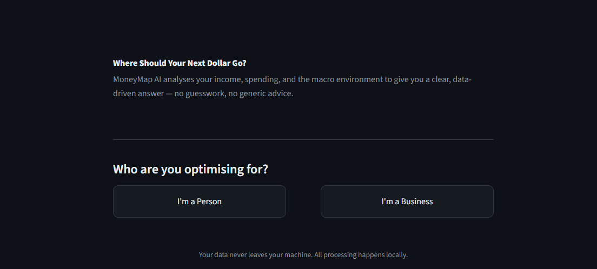
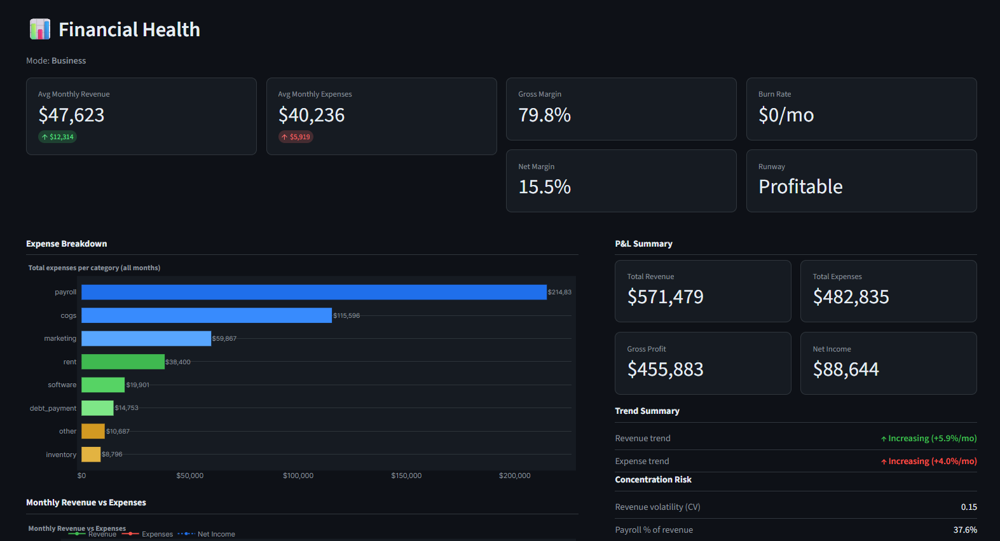
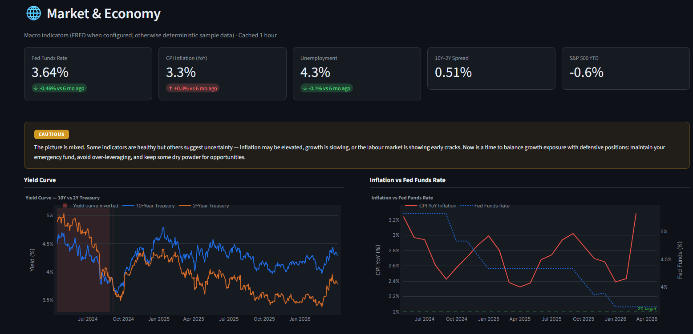
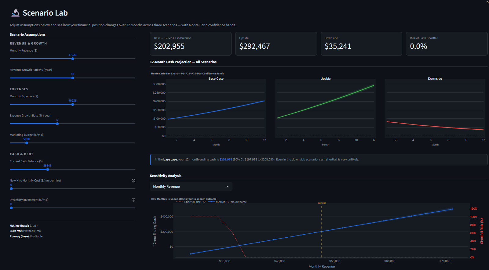
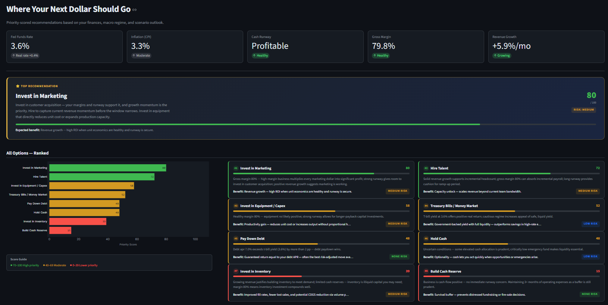

# 🧭 MoneyMap AI — Next Dollar Allocation Advisor

[](https://github.com/AhmedKamal-41/moneymap-ai/actions/workflows/ci.yml)
[](https://moneymap-ai-production.up.railway.app/)
[](https://www.python.org/downloads/)
[](https://streamlit.io)
[](LICENSE)
[](https://github.com/astral-sh/ruff)

**Live:** [https://moneymap-ai-production.up.railway.app/](https://moneymap-ai-production.up.railway.app/)

> **Where should your next dollar go?**
> Upload your finances, connect live macro data, and get a ranked, data-driven answer in minutes — no spreadsheets, no guesswork.

---

## Screenshots

Add app screenshots under `docs/screenshots/` so the table below shows real UI — see [`docs/screenshots/README.md`](docs/screenshots/README.md).

| Home | Financial Health |
|------|-----------------|
|  |  |

| Market & Economy | Scenario Lab |
|-----------------|--------------|
|  |  |

| Allocation Engine | Stress Test |
|------------------|-------------|
|  |  |

---

## Features

| Page | What it does |
|------|--------------|
| 🧭 **Home** | Choose personal or business mode to begin |
| 🔗 **Connect Data** | Upload a CSV/XLSX or load built-in sample data |
| 🩺 **Financial Health** | Cash position, burn rate, savings rate, spending breakdown, anomaly detection |
| 📡 **Market & Economy** | Live macro dashboard (FRED), regime badge, yield curve, inflation trend |
| 🧪 **Scenario Lab** | 12-month projections across base / upside / downside + Monte Carlo bands |
| 🎯 **Allocation Engine** | Ranked, scored recommendations with plain-English reasoning |
| 🛡️ **Stress Test** | Historical-style shocks (2008 GFC, COVID-19, inflation shock, mild recession, rate spike) + resilience score |
| 📄 **Report Center** | Download a polished PDF or Markdown report of the full analysis |

---

## Quick Start

### 1. Clone and set up

```bash
git clone https://github.com/AhmedKamal-41/moneymap-ai.git
cd moneymap-ai

python -m venv .venv
# macOS / Linux:
source .venv/bin/activate
# Windows:
.venv\Scripts\activate
```

### 2. Install dependencies

```bash
pip install -r requirements.txt
```

For the Jupyter notebooks under `notebooks/`, also install:

```bash
pip install -r requirements-notebooks.txt
```

### 3. Configure API keys

```bash
cp .env.example .env
# Edit .env and fill in your keys (see API Keys section below)
```

### 4. Launch

```bash
streamlit run app/Home.py
```

Open [http://localhost:8501](http://localhost:8501) in your browser.

**Requirements:** Python 3.11 or higher.

---

## Table of Contents

- [Live app (live)](https://moneymap-ai-production.up.railway.app/)
- [Overview](#overview)
- [Recommended Workflow](#recommended-workflow)
- [API Keys](#api-keys)
- [CSV Format](#csv-format)
- [Statistical Methods](#statistical-methods)
- [Data Sources](#data-sources)
- [Tech Stack](#tech-stack)
- [Project Structure](#project-structure)
- [Scripts](#scripts)
- [Running Tests](#running-tests)
- [Known Limitations](#known-limitations)
- [Roadmap](#roadmap)
- [Contributing](#contributing)
- [Acknowledgements](#acknowledgements)
- [Citation](#citation)
- [Disclaimer](#disclaimer)
- [License](#license)

---

## Overview

MoneyMap AI is an end-to-end personal and business financial intelligence tool built on Streamlit. It ingests your transaction history (CSV or XLSX), pulls live macroeconomic data from FRED, BLS, U.S. Treasury, and Alpha Vantage, runs Monte Carlo simulations and scenario analysis, and outputs a ranked allocation recommendation with plain-English reasoning.

**Try it live:** [MoneyMap AI(https://moneymap-ai-production.up.railway.app/) — no install required. When you **run the app yourself** (see [Quick Start](#quick-start)), your session runs on your own machine unless you deploy it to a host you control.

---

## Recommended Workflow

Use the numbered Streamlit pages in order so session state and guards stay consistent:

```
🧭 Home  →  🔗 Connect Data  →  🩺 Financial Health  →  📡 Market & Economy
→  🧪 Scenario Lab  →  🎯 Allocation Engine  →  🛡️ Stress Test  →  📄 Report Center
```

### Session guards (`app/page_guards.py`)

Pages call helpers that show a **Go to …** button and stop rendering when prerequisites are missing, instead of failing mid-page:

| Helper | Prerequisite enforced |
|--------|-----------------------|
| `require_mode()` | Any page after Home — user must pick personal or business |
| `require_raw_data()` | Scenario Lab — strict `raw_df` from Connect Data |
| `require_scenarios()` | Allocation, Stress, Report — scenario outputs from the lab |
| `require_allocation()` | Report — allocation result present |

---

## API Keys

Copy `.env.example` to `.env` and fill in the values:

```env
FRED_API_KEY=your_32_char_key_here
ALPHA_VANTAGE_API_KEY=your_key_here
BLS_API_KEY=your_key_here          # optional
```

| Variable | Required | Purpose | Where to get it |
|----------|----------|---------|-----------------|
| `FRED_API_KEY` | Recommended | Live Fed Funds Rate, CPI, Unemployment, Yield Curve (must be exactly 32 lowercase alphanumeric characters) | [fred.stlouisfed.org](https://fred.stlouisfed.org/docs/api/api_key.html) — free |
| `ALPHA_VANTAGE_API_KEY` | Recommended | Live equity / ETF daily prices, S&P 500 index | [alphavantage.co](https://www.alphavantage.co/support/#api-key) — free |
| `BLS_API_KEY` | Optional | Higher BLS API daily rate limits for CPI / employment data | [data.bls.gov](https://data.bls.gov/registrationEngine/) — free |

### Synthetic fallbacks

Without keys (or on any network/API error), all clients return **deterministic synthetic series** and emit `UserWarning`s. The full app remains functional — results simply reflect simulated rather than live data.

---

## CSV Format

### Personal finance (`data/sample/sample_personal.csv`)

| Column | Type | Notes |
|--------|------|-------|
| `date` | date | Any parseable date format |
| `amount` | float | Positive = income, negative = expense |
| `category` | string | e.g. `Housing`, `Food & Dining`, `Income` |
| `description` | string | Optional free-text label |

### Business finance (`data/sample/sample_business.csv`)

| Column | Type | Notes |
|--------|------|-------|
| `date` | date | Any parseable date format |
| `amount` | float | Positive = inflow, negative = outflow |
| `type` | string | e.g. `Revenue`, `Payroll`, `COGS` |
| `description` | string | Optional free-text label |

---

## Statistical Methods

| Method | Module | Used for |
|--------|--------|----------|
| **Monte Carlo simulation** (GBM) | `monte_carlo.py` | 12-month portfolio and cash-flow projection with confidence bands |
| **Value at Risk (VaR) / CVaR** | `risk_metrics.py` | Tail-risk quantification at 95 % and 99 % confidence, 1-day and 30-day horizons |
| **Sharpe ratio** | `portfolio_stats.py` | Risk-adjusted return measurement across portfolio and backtest strategies |
| **Beta / Max Drawdown** | `portfolio_stats.py` | Systematic risk and peak-to-trough loss measurement |
| **Sensitivity analysis** | `sensitivity.py` | One-at-a-time parameter sweeps to identify which inputs drive outcomes most |
| **Scenario modelling** | `scenario_engine.py` | Base, upside, and downside cash-flow projections with regime-conditioned assumptions |
| **Macro regime detection** | `market_analyzer.py` | Four-bucket classifier (Risk On / Cautious / Risk Off / Recession Warning) derived from yield spread, inflation, unemployment, and rate direction |
| **Anomaly detection** | `financial_health.py` | Statistical outliers (3 σ per category), duplicate charges, monthly spend spikes (> 30 % MoM) |

---

## Data Sources

| Source | Data | Link |
|--------|------|------|
| **FRED** — Federal Reserve Bank of St. Louis | Fed Funds Rate, CPI, Unemployment Rate, Treasury Yields, Yield Spread, GDP growth | [fred.stlouisfed.org](https://fred.stlouisfed.org/docs/api/api_key.html) |
| **BLS** — Bureau of Labor Statistics | CPI supplementary series, employment data | [data.bls.gov](https://data.bls.gov/registrationEngine/) |
| **U.S. Treasury** | Daily Treasury yield curve rates | [home.treasury.gov](https://home.treasury.gov/resource-center/data-chart-center/interest-rates/) |
| **Alpha Vantage** | Equity prices, S&P 500 index | [alphavantage.co](https://www.alphavantage.co/support/#api-key) |

### API behaviour (synthetic fallbacks)

MoneyMap follows **option A**: synthetic sample series live inside `src/api_clients/`, not only in the UI layer.

- **FRED** (`fred_client.py`): if `fredapi` / the API key is missing, or every dashboard series fails, `get_macro_dashboard()` returns `sample_macro_dashboard()` with `_is_fallback=True`.
- **BLS** (`bls_client.py`): if a CPI or wage pull is empty after retries, `_sample_cpi_wage_df()` fills the frame; `df.attrs["is_fallback"]` is set.
- **Treasury** (`treasury_client.py`): on fetch or filter failure, `_sample_treasury_rates()` is used.
- **Alpha Vantage** (`alpha_vantage_client.py`): missing key, rate limits, HTTP errors, or an empty post-filter window → `_sample_ohlcv()`.

Warnings are issued with `warnings.warn(..., UserWarning)` so developers notice demo data. **Sample data is not real market data** — always configure keys for production-style analysis.

---

## Tech Stack

| Layer | Technology |
|-------|-----------|
| UI | [Streamlit](https://streamlit.io) ≥ 1.35 |
| Charts | [Plotly](https://plotly.com/python/) ≥ 5.22 |
| Data | [pandas](https://pandas.pydata.org) ≥ 2.2, [NumPy](https://numpy.org) ≥ 1.26 |
| Statistics | [SciPy](https://scipy.org) ≥ 1.13, [statsmodels](https://www.statsmodels.org) ≥ 0.14, [scikit-learn](https://scikit-learn.org) ≥ 1.5 |
| Macro data | [fredapi](https://github.com/mortada/fredapi) ≥ 0.5, FRED REST API |
| XLSX support | [openpyxl](https://openpyxl.readthedocs.io) ≥ 3.1 |
| PDF export | [fpdf2](https://pyfpdf.github.io/fpdf2/) ≥ 2.7 |
| Tests | [pytest](https://pytest.org) ≥ 8.2, pytest-cov |
| Linting | [ruff](https://github.com/astral-sh/ruff) |
| CI | GitHub Actions |

---

## Project Structure

```
moneymap-ai/
├── app/
│   ├── Home.py                     # Entry point — mode selector
│   ├── page_guards.py              # Session-state prerequisite guards
│   └── pages/
│       ├── 1_Connect_Data.py
│       ├── 2_Financial_Health.py
│       ├── 3_Market_Economy.py
│       ├── 4_Scenario_Lab.py
│       ├── 5_Allocation_Engine.py
│       ├── 6_Stress_Test.py
│       └── 7_Report_Center.py
├── src/
│   ├── data_loader.py              # CSV/XLSX ingestion and validation
│   ├── analysis/
│   │   ├── allocation_engine.py    # Rule-based scoring and recommendation
│   │   ├── financial_health.py     # Personal and business health metrics
│   │   ├── market_analyzer.py      # Macro regime classification
│   │   ├── monte_carlo.py          # GBM portfolio and cash-flow simulation
│   │   ├── portfolio_stats.py      # Sharpe, beta, drawdown, annualised return
│   │   ├── report_builder.py       # PDF and Markdown report generation
│   │   ├── risk_metrics.py         # VaR, CVaR, confidence bands
│   │   ├── scenario_engine.py      # Base/upside/downside scenario builder
│   │   ├── sensitivity.py          # One-at-a-time parameter sweeps
│   │   └── stress_test.py          # Historical scenario replay and resilience score
│   ├── api_clients/
│   │   ├── alpha_vantage_client.py
│   │   ├── bls_client.py
│   │   ├── fred_client.py
│   │   └── treasury_client.py
│   └── utils/
│       ├── constants.py
│       └── formatting.py
├── data/
│   └── sample/
│       ├── sample_personal.csv
│       └── sample_business.csv
├── tests/
│   ├── test_allocation_engine.py   # Scoring rules, recommend(), explain_recommendation()
│   ├── test_api_sample_fallbacks.py# FRED/BLS/Treasury/Alpha Vantage synthetic fallbacks
│   ├── test_data_loader.py         # CSV parsing, validation, summary computation
│   ├── test_financial_health.py    # Personal/business health + anomalies
│   ├── test_market_analyzer.py     # Macro summary, regime, rate advice
│   ├── test_monte_carlo.py         # simulate_portfolio(), simulate_cash_flow()
│   ├── test_portfolio_stats.py     # Sharpe ratio, beta, max drawdown
│   ├── test_report_builder.py      # Markdown/PDF report pipeline
│   ├── test_risk_metrics.py        # VaR, CVaR, confidence bands
│   ├── test_scenario_engine.py     # Scenario builder + sensitivity table
│   ├── test_sensitivity.py         # Tornado chart / OAT sensitivity
│   └── test_stress_test.py         # SCENARIOS dict, run_stress_test(), resilience_score()
├── notebooks/
│   ├── 01_macro_eda.ipynb          # 20-year macro EDA and regime classification
│   ├── 02_allocation_model_dev.ipynb # Allocation model development and backtesting
│   └── 03_backtest_analysis.ipynb  # Strategy backtest analysis
├── docs/
│   └── screenshots/                # README images (placeholders or real captures)
├── .github/
│   └── workflows/
│       └── ci.yml                  # CI: pytest + ruff on push/PR
├── .streamlit/
│   └── config.toml                 # Dark theme configuration
├── scripts/
│   ├── gen_samples.py              # Generates sample_personal.csv and sample_business.csv
│   ├── generate_screenshot_placeholders.py
│   └── setup_repo.py               # Prints recommended GitHub topics after first push
├── .pre-commit-config.yaml         # Optional: ruff on commit
├── .env.example                    # API key template
├── pyproject.toml                  # Ruff + pytest settings, optional [dev] extras
├── requirements.txt                # App + test dependencies
├── requirements-notebooks.txt      # Additional notebook dependencies
└── LICENSE
```

---

## Scripts

| Script | Description |
|--------|-------------|
| `scripts/gen_samples.py` | Generates `data/sample/sample_personal.csv` and `data/sample/sample_business.csv` with 12 months of realistic seeded transactions. Run from the project root: `python scripts/gen_samples.py` |
| `scripts/generate_screenshot_placeholders.py` | Writes placeholder PNGs into `docs/screenshots/` for README previews (`pip install pillow` first). |
| `scripts/setup_repo.py` | One-time helper that prints the recommended GitHub repository topics to paste into Settings → Topics after your first push. Run: `python scripts/setup_repo.py` |

---

## Running Tests

Default options live in `pyproject.toml` (`[tool.pytest.ini_options]`). With coverage:

```bash
pytest --cov=src --cov-report=term-missing
```

The suite covers analysis modules plus offline API fallback smoke checks (no live network calls):

```
tests/test_allocation_engine.py    — scoring rules, recommend(), explain_recommendation()
tests/test_api_sample_fallbacks.py — FRED/BLS/Treasury/Alpha Vantage synthetic fallbacks
tests/test_data_loader.py          — CSV parsing, validation, summary computation
tests/test_financial_health.py     — analyze_personal_health, analyze_business_health, detect_anomalies
tests/test_market_analyzer.py      — get_macro_summary, regime_description, rate_environment_advice
tests/test_monte_carlo.py          — simulate_portfolio(), simulate_cash_flow(), summarize_simulations()
tests/test_portfolio_stats.py      — Sharpe ratio, beta, max drawdown, annualised return
tests/test_report_builder.py       — build_report, report_to_markdown, report_to_pdf_bytes
tests/test_risk_metrics.py         — VaR, CVaR, confidence bands
tests/test_scenario_engine.py      — build_scenarios, sensitivity_analysis
tests/test_sensitivity.py          — run_sensitivity (tornado chart data)
tests/test_stress_test.py          — SCENARIOS dict, run_stress_test(), resilience_score()
```

Run a quick compile check on guards after edits:

```bash
python -m py_compile app/page_guards.py
```

---

## Known Limitations

| Limitation | Detail |
|------------|--------|
| **Alpha Vantage free tier** | 25 requests/day, 5/minute. Sufficient for casual use; upgrade for frequent analysis. |
| **No real-time streaming** | Market data is end-of-day; the app is designed for daily/weekly analysis, not intraday. |
| **Single-currency** | All analysis assumes USD. Multi-currency portfolios require pre-conversion. |
| **No brokerage integration** | Data must be uploaded as CSV/XLSX; there is no direct broker API connection. |
| **Monte Carlo assumes GBM** | Geometric Brownian Motion does not capture fat tails or regime shifts in real returns. |
| **Allocation engine is rule-based** | Recommendations follow deterministic scoring rules, not a trained ML model. |
| **Session state is in-memory** | Closing or refreshing the browser tab clears all session data. |

---

## Roadmap

- [ ] OAuth-based brokerage data import (Plaid / Fidelity)
- [ ] Multi-currency support
- [ ] Persistent sessions (database-backed state)
- [ ] ML-based allocation model (replace rule engine)
- [ ] Shareable report links
- [ ] Docker / one-click deploy

---

## Contributing

Contributions, bug reports, and feature requests are welcome.

1. **Fork** the repository and create a feature branch (`git checkout -b feat/your-feature`)
2. Make your changes — run `pytest` and `ruff check src app tests` before committing (settings in `pyproject.toml`)
3. **Open a pull request** against `main` with a clear description of what changed and why

Optional: install [pre-commit](https://pre-commit.com) and run `pre-commit install` so **ruff** runs on every commit (see `.pre-commit-config.yaml`).

Please keep pull requests focused. One feature or fix per PR makes review faster.

### Code style

- Formatter / linter: **ruff** (config in `pyproject.toml`; E501 and E402 ignored)
- All analysis functions should be pure (no Streamlit calls) and covered by a test
- New API clients must implement a `_sample_*` synthetic fallback

---

## Acknowledgements

- **Federal Reserve Bank of St. Louis** — [FRED Economic Data](https://fred.stlouisfed.org) for macroeconomic time series
- **Bureau of Labor Statistics** — [BLS Public Data API](https://www.bls.gov/developers/) for CPI and employment data
- **U.S. Department of the Treasury** — [Daily Treasury Par Yield Curve Rates](https://home.treasury.gov/resource-center/data-chart-center/interest-rates/)
- **Alpha Vantage** — [Alpha Vantage API](https://www.alphavantage.co) for equity and index price data
- **Streamlit** — [streamlit.io](https://streamlit.io) for the app framework

---

## Citation

If you use MoneyMap AI in research or a project, please cite:

```bibtex
@software{moneymap_ai,
  title   = {MoneyMap AI — Next Dollar Allocation Advisor},
  author  = {AhmedKamal-41},
  year    = {2026},
  url     = {https://github.com/AhmedKamal-41/moneymap-ai},
  license = {MIT}
}
```

---

## Disclaimer

**MoneyMap AI is for informational and educational purposes only. It does not constitute financial, investment, tax, or legal advice. All projections, scenarios, and recommendations are generated by algorithmic models and may not reflect your actual situation. Past performance is not indicative of future results. Always consult a qualified financial advisor before making investment or financial decisions. The authors and contributors accept no liability for any financial decisions made based on this software.**

---

## License

MIT License — see [LICENSE](LICENSE) for details.
